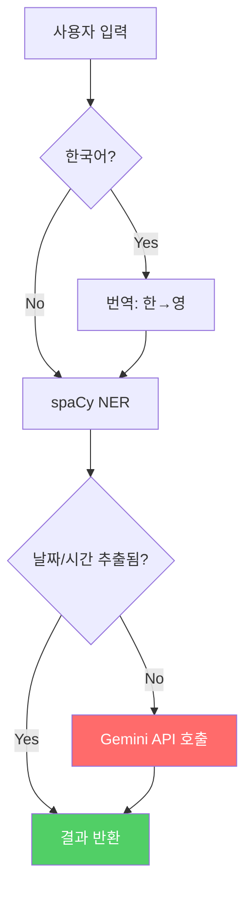
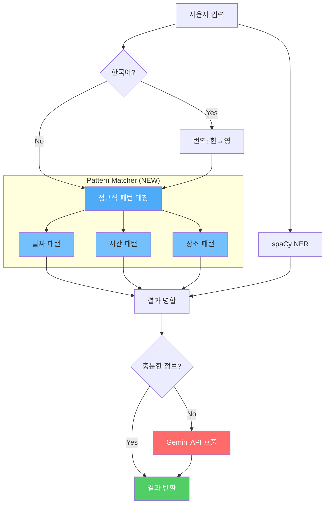

# Performance Optimization 계획서

> **작성일**: 2025-12-04  
> **목표**: Gemini 호출 최소화 및 응답 속도 개선

---

## 1. 현재 시스템 아키텍처

### 처리 흐름도



### 현재 처리 로직 (`main.py`)

```python
# Line 492
if is_ocr or not date_str or not time_str or " to " in translated_text:
    print("[AI] spaCy incomplete. Calling Gemini...")
    gemini_data = extract_info_with_gemini_json(original_text)
```

**문제점:**
- `date_str`, `time_str`이 빈 값이면 무조건 Gemini 호출
- spaCy가 "tomorrow", "next Friday" 등은 인식하지만 빈 값으로 처리될 수 있음

---

## 2. Before 측정 결과 (2025-12-04)

| 지표 | 결과 |
|------|------|
| Gemini 호출률 | 50% (5/10) |
| 평균 응답시간 | 6.24초 |
| - spaCy만 사용 시 | 3.15초 |
| - Gemini 사용 시 | 9.33초 |
| 한국어 장소 인식 | ❌ 실패 ("강남역") |

---

## 3. 개선 목표

```
Before                          After (목표)
────────────────────────────────────────────
Gemini 호출률: 50%      →      20% 이하
평균 응답시간: 6.24s    →      3초 이하
한국어 장소: 미인식     →      인식
```

---

## 4. 개선 방안: 커스텀 패턴 매처

### 개선된 처리 흐름도



### 핵심 변경점

| 구분 | 현재 | 개선 후 |
|------|------|---------|
| 1차 처리 | spaCy만 | **Pattern Matcher + spaCy** |
| Gemini 호출 조건 | date/time 없으면 호출 | 신뢰도 기반 판단 |
| 한국어 장소 | 미지원 | `~에서`, `~역` 패턴 인식 |

---

## 5. 구현 상세

### 5.1 Pattern Matcher 구조

```
pattern_matcher.py (NEW)
├── class SchedulePatternMatcher
│   ├── extract_dates(text) → List[str]
│   ├── extract_times(text) → List[str]
│   └── extract_locations(text) → Optional[str]
│
└── 정규식 패턴
    ├── 한국어 날짜: "12월 5일", "내일", "다음주 금요일"
    ├── 영어 날짜: "Dec 5", "tomorrow", "next Friday"
    ├── 시간: "오후 3시", "3pm", "15:00"
    └── 장소: "강남역에서", "at Seoul Station"
```

### 5.2 main.py 수정

```python
# Before
date_str, time_str, loc_str, event_str = run_ner_extraction(...)

# After
pm = SchedulePatternMatcher()
pm_dates = pm.extract_dates(original_text)  # 원본에서 직접 추출
pm_times = pm.extract_times(original_text)
pm_loc = pm.extract_locations(original_text)

# spaCy 결과와 병합
final_date = pm_dates[0] if pm_dates else date_str
final_time = pm_times[0] if pm_times else time_str
final_loc = pm_loc if pm_loc else loc_str
```

### 5.3 Gemini 호출 조건 변경

```python
# Before (현재)
if not date_str or not time_str:
    call_gemini()

# After (개선)
confidence = calculate_confidence(final_date, final_time, final_loc)
if confidence < 0.7 and mode != "fast":
    call_gemini()
```

---

## 6. 파일 변경 목록

| 파일 | 변경 유형 | 내용 |
|------|----------|------|
| `pattern_matcher.py` | **NEW** | 패턴 매칭 로직 |
| `main.py` | MODIFY | 패턴 매처 통합 |

---

## 7. 검증 계획

1. **After 측정**: `python benchmark.py after`
2. **비교**: `optimization_report.md` 업데이트
3. **채택 기준**:
   - Gemini 호출률 30% 이상 감소 ✅
   - 평균 응답시간 1초 이상 단축 ✅
